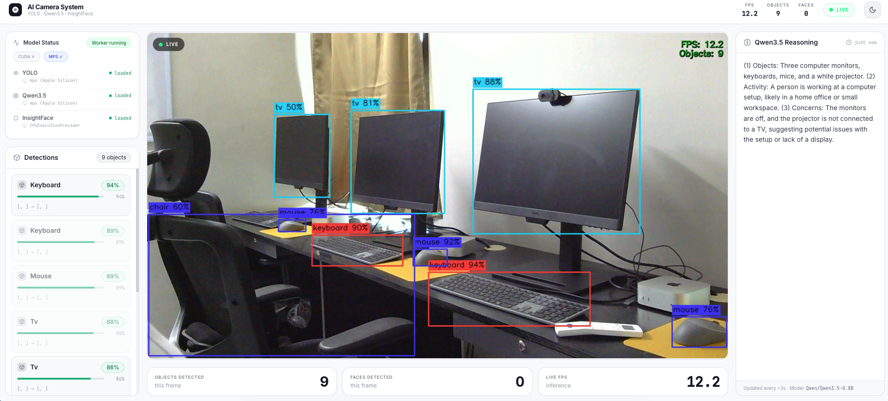
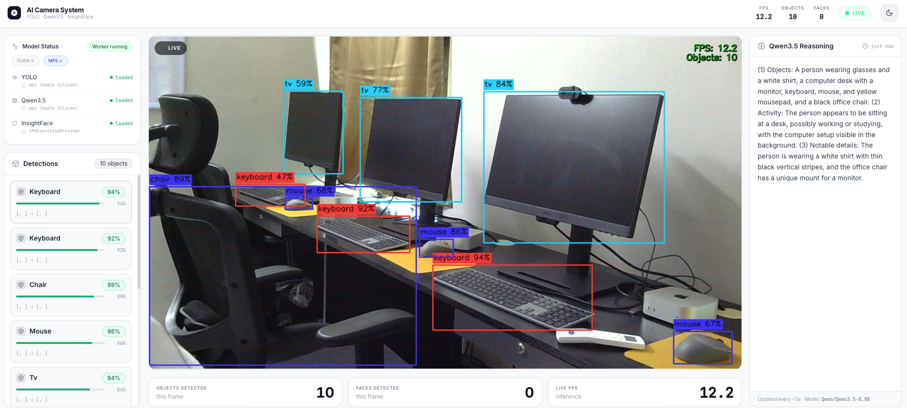
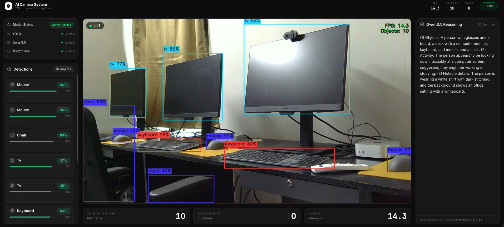

<div align="center">

# 🎥 AI Camera System

**Real-time object detection, face recognition, and scene reasoning over a live camera feed**

[](https://python.org)
[](https://fastapi.tiangolo.com)
[](https://pytorch.org)
[](LICENSE)

</div>

---

## 📖 Overview

AI Camera System is a production-ready backend that streams a live camera feed through a multi-model AI pipeline:

- **YOLOv8** detects objects in every frame and draws coloured bounding boxes with label tags
- **InsightFace** (ArcFace) detects faces and overlays teal boxes with 5-point landmarks
- **Qwen3.5-0.8B** (Vision-Language Model) analyses the scene every few seconds and generates a natural language description in the background — without stalling the camera loop

The annotated stream is served as MJPEG over HTTP. Detection results and VLM reasoning are pushed to connected clients over WebSocket.

---

## 🏗️ Architecture

```
Camera (OpenCV)
      │
      ▼
┌─────────────────────────────────────────────────────┐
│  Thread 1 — Fast Loop  (targets 15 FPS)             │
│  Capture → YOLO → InsightFace → Annotate → JPEG     │
│                │                                    │
│                └─── non-blocking submit ──▶ Thread 2│
└─────────────────────────────────────────────────────┘
                                │
                                ▼
┌─────────────────────────────────────────────────────┐
│  Thread 2 — Qwen VLM  (runs independently)          │
│  Frame queue (1-slot) → Qwen3.5-0.8B → reasoning   │
└─────────────────────────────────────────────────────┘
                                │
                                ▼
                        SharedState (Lock)
                          ┌──────────┐
                          │ FastAPI  │
                          ├──────────┤
                          │ /stream  │ ← MJPEG multipart
                          │ /ws      │ ← WebSocket JSON
                          │ /detect  │ ← REST JSON
                          └──────────┘
```

> **Key design decision:** Qwen runs in a dedicated thread with a 1-slot non-blocking queue. If Qwen is still processing a previous frame, new frames are silently dropped — the camera loop never waits.

### 📸 Sample Output

| Object & Face Detection | Scene Reasoning | Multi-object |
|:---:|:---:|:---:|
|  |  |  |

---


## 📁 Project Structure

```
myvlm/
├── main.py                          # Uvicorn entrypoint (re-exports backend app)
├── requirements.txt                 # All Python dependencies
├── .env.example                     # Example environment variables
│
└── backend/
    ├── main.py                      # FastAPI app, lifespan, CORS, router registration
    ├── config.py                    # All settings — overridable via environment variables
    │
    ├── ai/
    │   ├── yolo_detector.py         # YOLOv8 detection + bounding box drawing
    │   ├── qwen_reasoning.py        # Qwen3.5-0.8B VLM via transformers pipeline
    │   └── face_recognizer.py       # InsightFace face detection + ArcFace embeddings
    │
    ├── routes/
    │   ├── stream.py                # GET  /api/stream        — MJPEG live stream
    │   │                            # GET  /api/stream/snapshot — single JPEG
    │   ├── detect.py                # GET  /api/detect/latest — live JSON results
    │   │                            # POST /api/detect/frame  — upload image
    │   │                            # GET  /api/detect/health — model status
    │   └── ws.py                    # WS   /api/ws            — push JSON every 500ms
    │
    └── workers/
        └── inference_worker.py      # Two-thread pipeline + SharedState
```

---

## 🧠 Models & Stack

| Component | Model / Library | Purpose |
|---|---|---|
| **Object Detection** | [YOLOv8n](https://github.com/ultralytics/ultralytics) (Ultralytics) | Per-frame object detection, bbox drawing |
| **Vision-Language Model** | [Qwen/Qwen3.5-0.8B](https://huggingface.co/Qwen/Qwen3.5-0.8B) | Scene understanding and natural language reasoning |
| **Face Detection** | [InsightFace buffalo_l](https://github.com/deepinsight/insightface) + ArcFace | Face detection, 5-point landmarks, 512-d embeddings |
| **Web Framework** | [FastAPI](https://fastapi.tiangolo.com) + [Uvicorn](https://www.uvicorn.org) | Async REST API + WebSocket + MJPEG streaming |
| **Computer Vision** | [OpenCV](https://opencv.org) (headless) | Camera capture, frame annotation, JPEG encoding |
| **Deep Learning** | [PyTorch](https://pytorch.org) + [HuggingFace Transformers](https://huggingface.co/docs/transformers) | Model inference backbone |
| **ONNX Runtime** | [onnxruntime](https://onnxruntime.ai) | InsightFace ONNX model execution (CPU/GPU) |

---

## 🚀 Getting Started

### Prerequisites

- Python **3.11+**
- A webcam connected, or an RTSP/IP camera URL
- ~4 GB RAM (CPU inference); 4 GB VRAM for GPU

### 1. Clone & set up virtual environment

```bash
git clone <your-repo-url>
cd myvlm

python -m venv .venv
source .venv/bin/activate   # Windows: .venv\Scripts\activate
```

### 2. Install dependencies

```bash
pip install -r requirements.txt
```

> **GPU (CUDA) support:** Replace the default CPU torch with:
> ```bash
> pip install torch torchvision --index-url https://download.pytorch.org/whl/cu121
> pip install onnxruntime-gpu
> ```

### 3. Configure environment

```bash
cp .env.example .env
# Edit .env as needed
```

### 4. Start the backend

```bash
uvicorn main:app --host 0.0.0.0 --port 8001 --reload
```

On first start, the following models are downloaded automatically:
- `yolov8n.pt` (~6 MB, Ultralytics auto-download)
- `Qwen/Qwen3.5-0.8B` (~1.5 GB, HuggingFace Hub)
- `buffalo_l` (~300 MB, InsightFace auto-download)

---

## 🌐 API Reference

| Method | Endpoint | Description |
|--------|----------|-------------|
| `GET` | `/` | API info and endpoint map |
| `GET` | `/health` | Server health + worker status |
| `GET` | `/docs` | Swagger UI (interactive API docs) |
| `GET` | `/api/stream` | **MJPEG live stream** — embed in `` |
| `GET` | `/api/stream/snapshot` | Single annotated JPEG frame |
| `WS`  | `/api/ws` | WebSocket — pushes detection JSON every 500 ms |
| `GET` | `/api/detect/latest` | Latest detections from the live worker |
| `POST`| `/api/detect/frame` | Upload an image for one-shot detection |
| `GET` | `/api/detect/health` | Model load status (YOLO / Qwen / InsightFace) |

### WebSocket payload (`/api/ws`)

```json
{
  "detections": [
    { "label": "person", "confidence": 0.89, "bbox": [x1, y1, x2, y2], "class_id": 0, "track_id": null }
  ],
  "faces": [
    { "confidence": 0.94, "bbox": [x1, y1, x2, y2] }
  ],
  "reasoning": "A person with glasses is seated at a desk, working on a document...",
  "fps": 12.4,
  "frame_timestamp": 1741163539.12
}
```

---

## ⚙️ Configuration

All settings can be overridden via environment variables (see `.env.example`):

| Variable | Default | Description |
|---|---|---|
| `CAMERA_SOURCE` | `0` | Camera index or RTSP URL |
| `FRAME_WIDTH` | `1280` | Capture width |
| `FRAME_HEIGHT` | `720` | Capture height |
| `YOLO_MODEL` | `yolov8n.pt` | YOLO model file (`yolov8s.pt` = more accurate) |
| `YOLO_CONF` | `0.45` | Detection confidence threshold |
| `YOLO_DEVICE` | `cpu` | `cpu` \| `cuda` \| `mps` |
| `QWEN_MODEL_ID` | `Qwen/Qwen3.5-0.8B` | HuggingFace model ID |
| `QWEN_MAX_NEW_TOKENS` | `150` | Max tokens per VLM response |
| `QWEN_REASON_INTERVAL` | `3.0` | Seconds between VLM calls |
| `QWEN_DEVICE` | `cpu` | `cpu` \| `cuda` \| `mps` |
| `WORKER_MAX_FPS` | `15.0` | Fast-loop FPS cap |
| `STREAM_JPEG_QUALITY` | `80` | MJPEG compression quality (1–95) |
| `CORS_ORIGINS` | `http://localhost:3000,...` | Allowed frontend origins |

---

## 🖥️ VPS Deployment

```bash
# Install with GPU support
pip install torch torchvision --index-url https://download.pytorch.org/whl/cu121
pip install onnxruntime-gpu -r requirements.txt

# Run (single worker — models must share process memory)
YOLO_DEVICE=cuda QWEN_DEVICE=cuda \
  uvicorn main:app --host 0.0.0.0 --port 8001 --workers 1
```

> Use **1 worker only** — models are loaded into process memory and are not shared across workers.

For nginx reverse proxy, add:
```nginx
location /api/stream {
    proxy_pass         http://127.0.0.1:8001;
    proxy_buffering    off;        # critical for MJPEG
    proxy_cache        off;
}

location /api/ws {
    proxy_pass         http://127.0.0.1:8001;
    proxy_http_version 1.1;
    proxy_set_header   Upgrade $http_upgrade;
    proxy_set_header   Connection "upgrade";
}
```

---

## 📄 License

MIT © 2026
